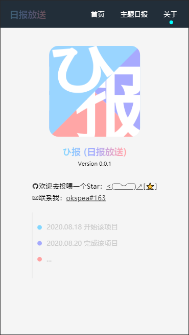

# daily-news 日报放送

>#### 该项目是一个x乎日报的Web app, 使用vue构建。由于找不到api的缘故，所有数据都是通过本地文件传入来实现模拟。
> 参考自这个项目([vue-zhihu-daily](https://github.com/hilongjw/vue-zhihu-daily))，并做了部分修改
---
## 预览




## Related content
+ Vue.js
+ vue-router
+ vuex

## Project setup
```
npm install
```

### Compiles and hot-reloads for development
```
npm run serve
```

### Compiles and minifies for production
```
npm run build
```

### Lints and fixes files
```
npm run lint
```

### Customize configuration
See [Configuration Reference](https://cli.vuejs.org/config/).
